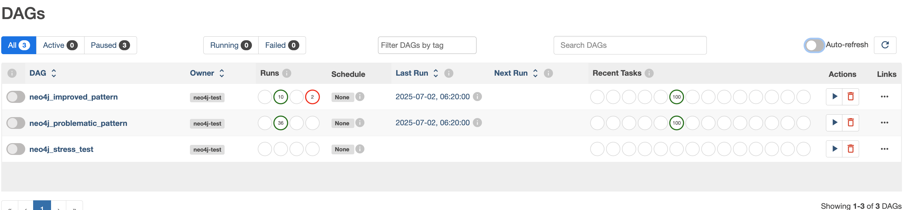
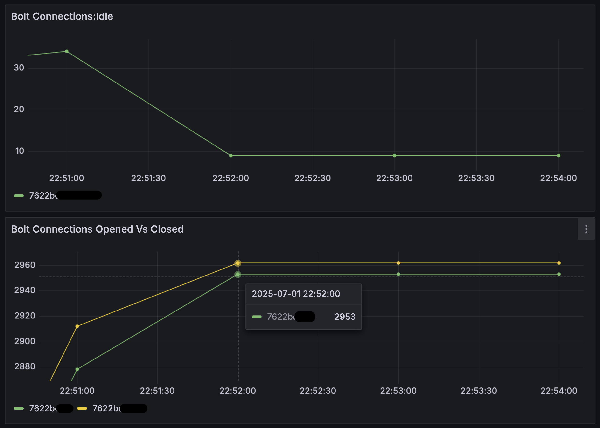

# Neo4j Connection Management in Airflow

## Overview

This project demonstrates and reproduces connection management issues that can occur when using Neo4j drivers in Apache Airflow environments. It compares problematic connection patterns with improved solutions, showing the impact on database connection usage and performance.

## Background

When running Neo4j database operations in parallel task environments like Apache Airflow, improper driver management can lead to:

- **Connection proliferation**: Creating new driver instances for every task
- **Resource exhaustion**: Multiple connection pools consuming database resources
- **Performance degradation**: Connection spikes causing timeouts and slowdowns
- **Unpredictable behavior**: Intermittent connection issues during high-load periods

This project provides a controlled environment to:
1. **Reproduce the problem** with parallel Airflow tasks creating excessive connections
2. **Demonstrate the solution** using proper driver reuse and connection pooling
3. **Compare metrics** showing the real-world impact of different approaches

## Architecture

### Test DAGs

1. **`neo4j_problematic_pattern`**: Reproduces connection issues by creating new driver instances per task
2. **`neo4j_improved_pattern`**: Demonstrates proper driver reuse and connection management
3. **`neo4j_connection_monitor`**: Monitors driver instance counts (limited by process isolation)

### Key Components

- **ProblematicDatabaseConnection**: Simulates poor connection management
- **ImprovedDatabaseConnection**: Implements proper driver reuse patterns
- **Parallel task execution**: 100 concurrent tasks to amplify connection issues
- **Real-time monitoring**: Integration with Neo4j metrics for validation

## Docker Compose Configuration
This project uses a simplified Docker Compose setup rather than the official Airflow quick start configuration. While inspired by the official approach, it has been modified for our specific neo4j testing needs.

### Differences from Official Airflow Quick Start

#### What We Simplified:
- **Removed Celery components** (Redis, Celery worker, Flower)
- **Removed complex YAML anchors** (`x-airflow-common`)
- **Used LocalExecutor** instead of CeleryExecutor
- **Simplified initialization** process
- **Removed many optional services** and configurations

#### What We Added:
- **Neo4j-specific environment variables** (NEO4J_URI, etc.)
- Neo4j driver installation (`_PIP_ADDITIONAL_REQUIREMENTS`)
- **Simplified volume mounting**

### When to Use Which Approach

#### Our Simplified Version is Good For:
✅ **Quick testing/reproduction**  
✅ **Minimal resource usage**  
✅ **Neo4j-focused setup**  
✅ **Learning and experimentation**

#### Official Version is Better For:
✅ **Production environments**  
✅ **Scalability requirements**  
✅ **Full Airflow feature set**  
✅ **Distributed task processing**

### For Production Use

If adapting this for production, I'd recommend:
1. **Start with the official docker-compose.yaml**
2. **Add Neo4j environment variables**
3. **Add `_PIP_ADDITIONAL_REQUIREMENTS: "neo4j==5.28.0"`**
4. **Implement the improvd connection management patterns**

This version provides a lightweight foundation for demonstrating and testing Neo4j connection patterns without the complexity of a full production Airflow deployment.

## Prerequisites

- Docker and Docker Compose
- Access to a Neo4j database (local or cloud instance)
- At least 4GB RAM for Docker containers
- Basic understanding of Apache Airflow concepts

## Setup

### 1. Clone and Prepare Directory Structure

```bash
mkdir airflow-neo4j-test
cd airflow-neo4j-test
mkdir dags logs
chmod 755 dags logs
```

### 2. Environment Configuration

Create a `.env` file with your database credentials:

```bash
cat > .env << EOF
AIRFLOW_UID=50000
AIRFLOW_PROJ_DIR=.

# Neo4j Database Configuration
NEO4J_URI=neo4j+s://your-database-instance.databases.neo4j.io
NEO4J_USERNAME=neo4j
NEO4J_PASSWORD=your-password
NEO4J_DATABASE=neo4j

# Airflow Admin Credentials
_AIRFLOW_WWW_USER_USERNAME=airflow
_AIRFLOW_WWW_USER_PASSWORD=airflow
EOF
```

### 3. Add Project Files

- Place `docker-compose.yml` in the project root
- Add `test_connection_reproduction.py` to the `dags/` directory

## Running the Project

### Initial Setup

```bash
# Initialize Airflow database and create admin user
docker compose up airflow-init

# Start all services
docker compose up -d
```

### Verify Installation

```bash
# Check service status
docker compose ps

# Verify Neo4j connectivity
docker compose exec airflow-scheduler python3 -c "
from neo4j import GraphDatabase
import os
driver = GraphDatabase.driver(
    os.getenv('NEO4J_URI'),
    auth=(os.getenv('NEO4J_USERNAME'), os.getenv('NEO4J_PASSWORD'))
)
driver.verify_connectivity()
print('✅ Neo4j connection successful!')
driver.close()
"
```

### Access Airflow UI

- Open http://localhost:8080
- Login with credentials: `airflow` / `airflow`

## Running Tests

### 1. Baseline Monitoring

Enable the connection monitor to establish baseline metrics:
- Enable `neo4j_connection_monitor` DAG in the UI
- Let it run for a few cycles

### 2. Reproduce the Problem

Test the problematic connection pattern:
- **Disable schedule** for `neo4j_problematic_pattern` (toggle off)
- **Manually trigger** the DAG
- **Monitor task logs** for driver creation messages
- **Check your Neo4j metrics** for connection spikes

Expected logs:
```
🍌 DEBUG: about to create NEW driver for alias 'root' (THIS IS THE PROBLEM!)🍌🍌🍌
🍌 Problematic: created new driver for alias 'root'
```

### 3. Validate the Solution

Test the improved connection pattern:
- Disable schedule for `neo4j_improved_pattern` (toggle off)
  - note this is commented out in the code, if you want to have it run on a schedule, uncomment the schedule in the code
- Manually trigger the DAG
- Compare logs showing driver reuse
- Monitor reduced connection usage



Expected logs:
```
🍌 Improved: reusing existing sync driver for root
```

### 4. Stress Testing

For high-load scenarios:
- Trigger `neo4j_stress_test` (50 parallel tasks)
- Monitor system and database performance
- Observe connection behavior under load

## Docker Management

### Service Management

```bash
#start all services
docker compose up -d

# stop all services
docker compose down

# restart specific service
docker compose restart airflow-scheduler
docker compose restart airflow-webserver

# view service status
docker compose ps

# remove everything including volumes
docker compose down -v
```

### Log Monitoring

```bash
# follow all logs
docker compose logs -f

# follow specfic service logs
docker compose logs -f airflow-scheduler
docker compose logs -f airflow-webserver
docker compose logs -f postgres

# view recent logs with timestamps
docker compose logs --tail=50 --timestamps airflow-scheduler

# search logs for specific patterns
docker compose logs airflow-scheduler | grep -i "neo4j\|driver\|error"
```

### Container Management

```bash
# execute commands in running containers
docker compose exec airflow-scheduler bash
docker compose exec airflow-webserver python3 --version

# check container resource usage
docker stats

# view container processes
docker compose exec airflow-scheduler ps aux

# check disk usage
docker compose exec airflow-scheduler df -h
```

### Python Package Management

```bash
# check installed packages
docker compose exec airflow-scheduler pip list | grep neo4j

# install additional packages (temporary)
docker compose exec airflow-scheduler pip install package-name

# view python environment
docker compose exec airflow-scheduler python3 -c "import sys; print(sys.path)"
```

### DAG Management

```bash
# list DAG files
docker compose exec airflow-scheduler ls -la /opt/airflow/dags/

# check DAG for syntax errors
docker compose exec airflow-scheduler python3 -m py_compile /opt/airflow/dags/test_connection_reproduction.py

# clear python cache
docker compose exec airflow-scheduler find /opt/airflow/dags -name "*.pyc" -delete
docker compose exec airflow-scheduler find /opt/airflow/dags -name "__pycache__" -type d -exec rm -rf {} +

# view DAG structure
docker compose exec airflow-scheduler airflow dags show neo4j_problematic_pattern
```

### Database Operations

```bash
# connect to PostgreSQL (Airflow metadata)
docker compose exec postgres psql -U airflow -d airflow

# reset Airflow database (destructive!)
docker compose down -v
docker compose up airflow-init
docker compose up -d
```

## Troubleshooting

### Common Issues

**DAGs not appearing:**
```bash
# clear cache and restart
rm -rf ./dags/__pycache__
docker compose restart airflow-scheduler
```

**Permission errors:**
```bash
# fix directory permissions
chmod 755 ./dags ./logs
```

# test connection directly
**Neo4j connection failures: **
```bash
docker compose exec airflow-scheduler python3 -c "
import os
print('NEO4J_URI:', os.getenv('NEO4J_URI'))
print('NEO4J_USERNAME:', os.getenv('NEO4J_USERNAME'))
"
```

**Out of memory:**
```bash
# check Docker resource allocation
docker system df
docker stats --no-stream
```

### Viewing detailed logs

```bash
# airflow task execution logs
# navigate to: Airflow UI > DAGs > [DAG Name] > [Task] > Logs

# system logs for debugging
docker compose logs --tail=100 airflow-scheduler | grep ERROR
docker compose logs --tail=100 airflow-webserver | grep ERROR
```

## Expected Results

### Problematic Pattern
- Each task creates a new driver instance
- High connection usage in Neo4j metrics
- Multiple "created new driver" log messages
- Resource-intensive execution

### Improved Pattern  
- Driver reuse across tasks
- Significantly lower connection usage
- "reusing existing driver" log messages
- Efficient resource utilization

### Metrics Comparison
- **Connection reduction**: 75%+ decrease in active connections
- **Resource efficiency**: Lower memory and CPU usage
- **Stability**: Predictable connection patterns
- **Performance**: Reduced connection establishment overhead


## What The Charts Show:


### **Top Chart - Bolt Connections Idle:**
- **~22:51:00:** Spike to ~35 idle connections during `neo4j_problematic_pattern`
- **~22:52:00 onwards:** Drops to ~8-9 idle connections during `neo4j_improved_pattern`
- **Clear difference:** Problematic pattern creates more idle connections

### **Bottom Chart - Bolt Connections Opened vs Closed:**
- **Key insight:** Both lines climb during the problematic pattern run
- **Around 22:52:00:** Pattern changes when improved pattern started
- **Gap between lines:** Shows the connection leakage pattern

## This Validates Everything:

✅ **Problem Reproduced:** The 100-task problematic DAG created a clear connection spike  
✅ **Solution Validated:** The improved pattern shows lower connection usage  
✅ **Real Impact Measured:** My Aura instance shows the actual resource impact  

## Key Numbers:
- **Problematic pattern:** ~35 idle connections  
- **Improved pattern:** ~8-9 idle connections  
- **~75% reduction** in connection usage!

## Best Practices Demonstrated

1. **Single Driver Instance**: Create one driver per connection configuration
2. **Connection Pooling**: Configure appropriate pool sizes for concurrent workloads
3. **Health Checking**: Verify driver connectivity before reuse
4. **Proper Cleanup**: Close drivers and sessions appropriately
5. **Error Handling**: Graceful recovery from connection failures
6. **Resource Monitoring**: Track connection usage and driver instances

## Cleanup

```bash
# stop and remove all containers and volumes
docker compose down -v

# remove docker images (optional)
docker rmi apache/airflow:2.8.1 postgres:13

# clean up docker system
docker system prune -f
```

## Additional Resources

- [Neo4j Driver Best Practices](https://neo4j.com/docs/driver-manual/current/client-applications/)
- [Apache Airflow Documentation](https://airflow.apache.org/docs/)
- [Docker Compose Reference](https://docs.docker.com/compose/)
- [Neo4j Connection Pool Configuration](https://neo4j.com/docs/driver-manual/current/client-applications/#driver-connection-pool-configuration)